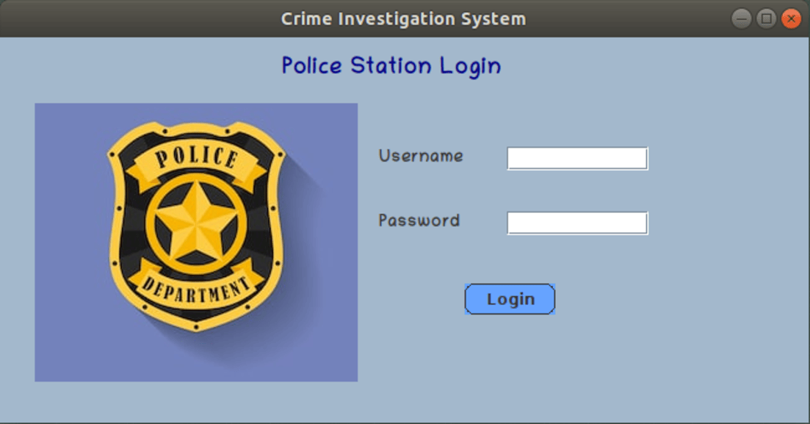
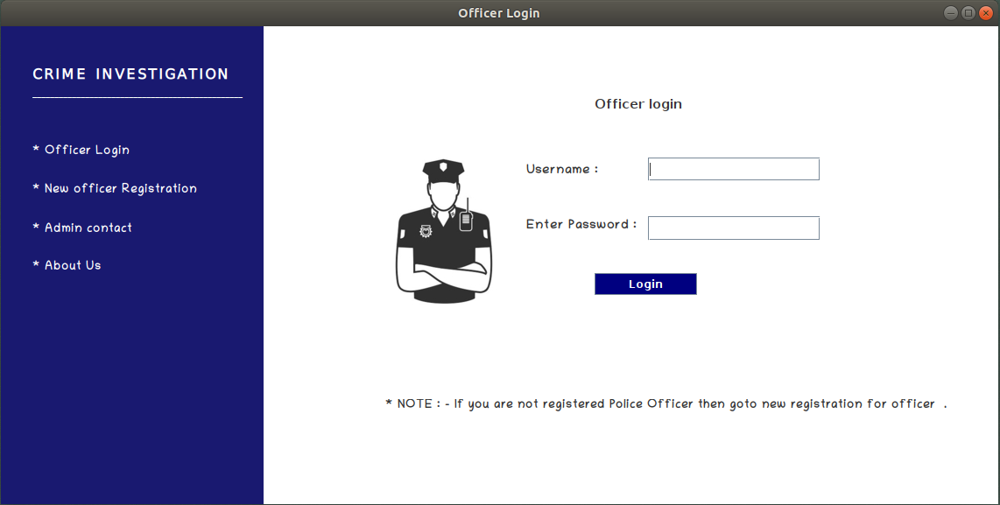
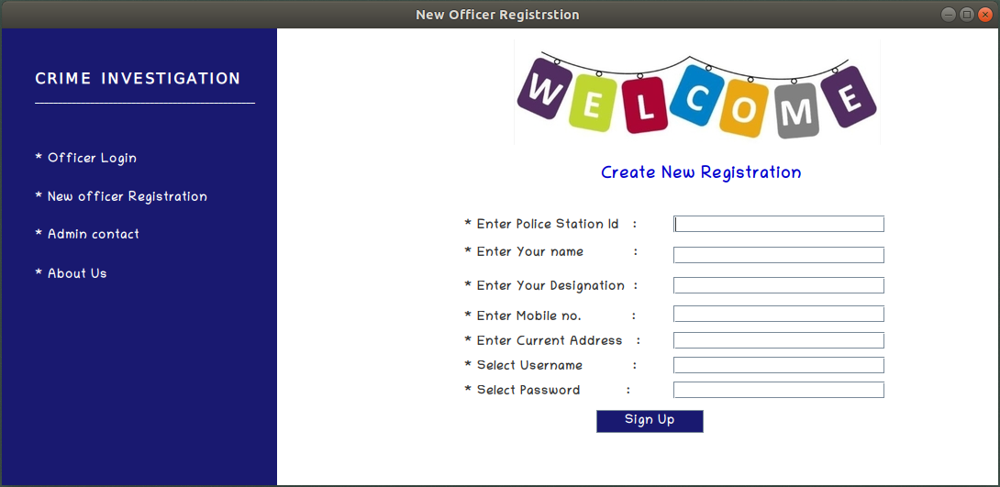
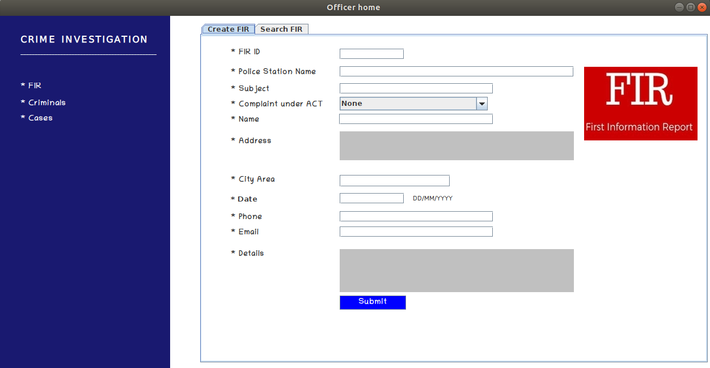
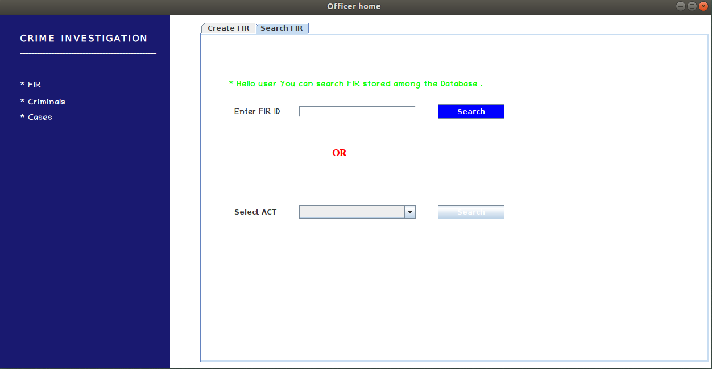

# Crime Management System

A Java-based crime management system with a MySQL database, allowing police officers to manage crime records efficiently through a user-friendly interface.

## Features

- **User Authentication** – Secure login for police officers.
- **Officer Management** – Register and manage police officer details.
- **Crime Records** – Input, search, and manage crime reports and FIRs.
- **Search Functionality** – Quickly find crime reports using filters.
- **User-Friendly Interface** – Intuitive UI built with Java Swing.

## Technologies Used

- **Java (Swing)** – Frontend for user interaction.
- **MySQL** – Database for storing crime records.
- **JDBC** – For database connectivity.

## Setup Instructions

### 1. Clone the Repository
```bash
git clone https://github.com/ap-atul/Crime-Investigation-System.git

cd Crime-Investigation-System
```
### 2. Database setup

- Install and run MySQL.
- Create a new database:
```bash
CREATE DATABASE CrimeInvestigations;
```
- Import the provided SQL file:
```bash
mysql -u [username] -p CrimeInvestigations < db.sql
```

### 3. Configure Database Connection

Modify the database connection details in the Java files (e.g., DatabaseConnection.java):
```bash
String url = "jdbc:mysql://localhost:3306/CrimeInvestigations";
String user = "your-username";
String password = "your-password";
```

### 4. Compile and Run the Project

- compile java files:
```bash
javac -cp .:mysql-connector-java.jar src/*.java
```
- run the application:
```bash
java -cp .:mysql-connector-java.jar src.Main
```

## Database Schema

The system consists of three main tables:
- **police_station** – Stores police station credentials.
- **police_officer** – Manages police officers linked to a station.
- **fir** – Holds First Information Reports (FIRs).

## Screenshots

1. **Login Screen:**

   

2. **Officer Dashboard:**
   

3. **Officer Registration:**
   

4. **Data Entry:**
   

5. **Search Functionality:**
   
